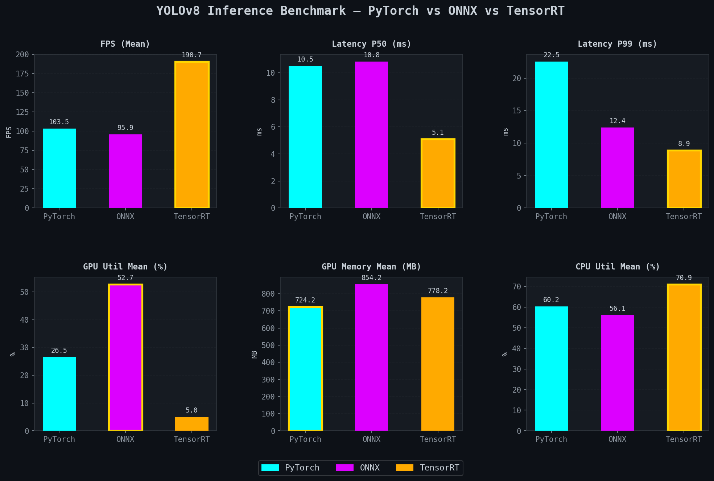
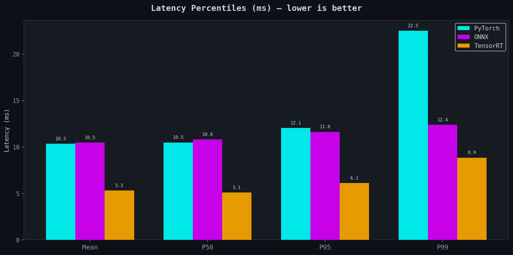
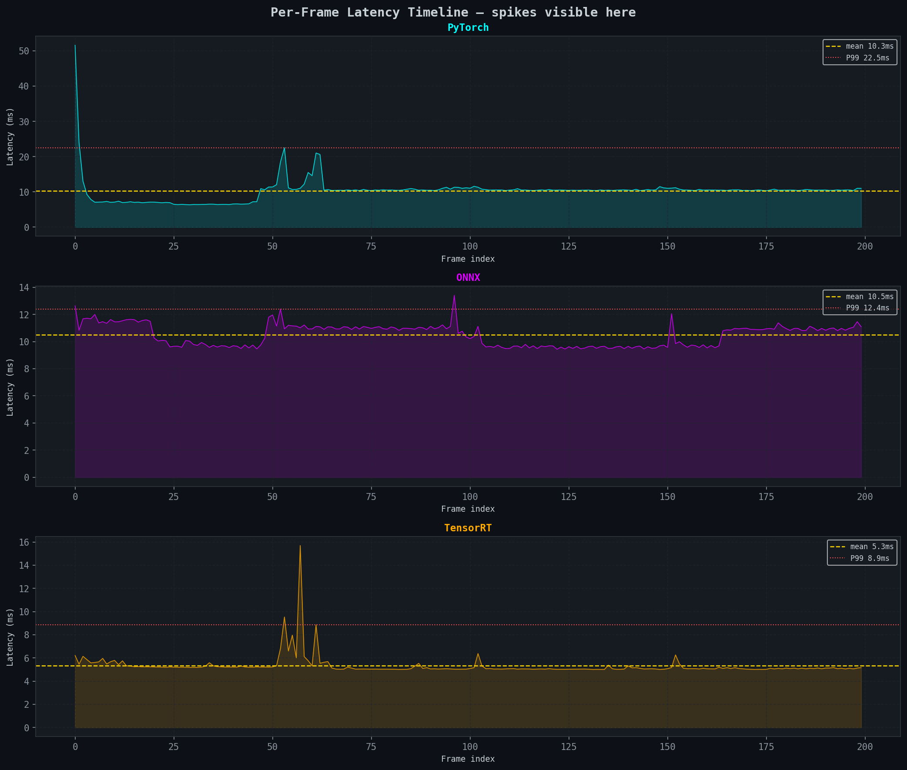
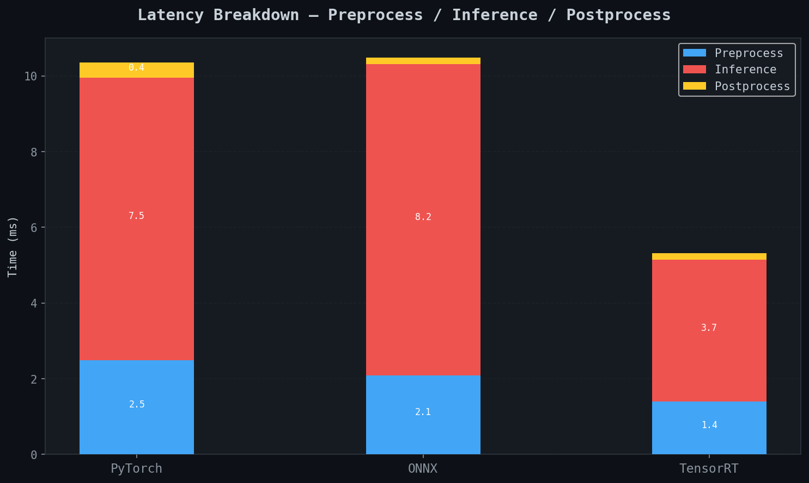
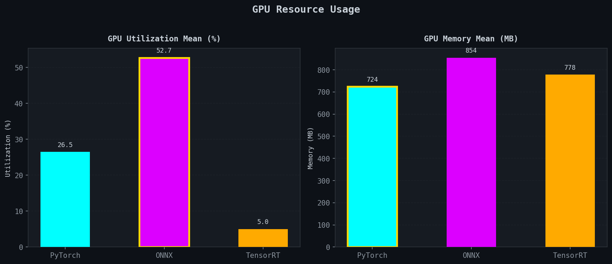
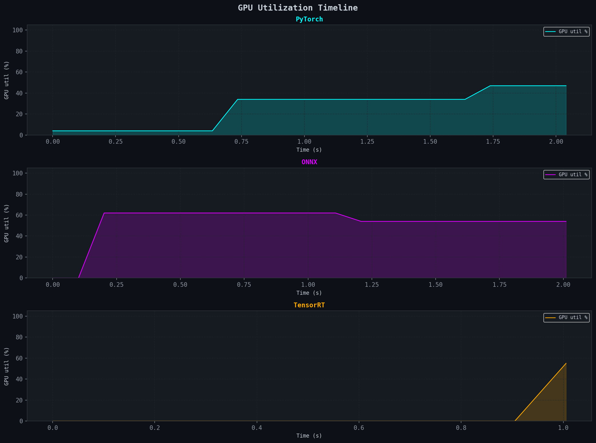
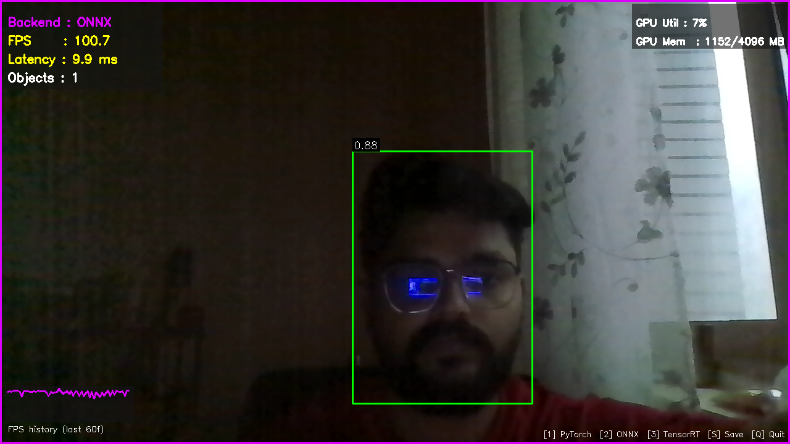

# YOLOv8 Inference Benchmark
### PyTorch vs ONNX Runtime vs TensorRT with Real-Time Webcam Inference



> Trained a custom [YOLOv8n head detection model](https://github.com/AbhijithP96/yolo-head-detection), then deployed it across three inference backends and measured FPS, latency (P50/P95/P99), GPU utilization, and memory usage on a real-time webcam stream.

---

## Results on NVIDIA GeForce RTX 3050 Laptop GPU (4GB VRAM)

| Metric | PyTorch | ONNX Runtime | TensorRT |
|---|---|---|---|
| **FPS (mean)** | 103.5 | 95.9 | **190.7** |
| **Latency P50 (ms)** | 10.50 | 10.82 | **5.10** |
| **Latency P95 (ms)** | 12.06 | 11.64 | **6.12** |
| **Latency P99 (ms)** | 22.53 | 12.40 | **8.86** |
| **Latency max (ms)** | 51.58 | 13.40 | 15.70 |
| **GPU util mean (%)** | 26.5 | 52.7 | 5.0 |
| **GPU mem mean (MB)** | 724 | 854 | 778 |

### Key Findings

**TensorRT is 1.84× faster than PyTorch** at the same accuracy --> 190 FPS vs 103 FPS on a laptop GPU.

**PyTorch has the worst P99 latency (22.53ms)** --> more than 2× its median. For real-time applications, P99 matters as much as mean FPS.

**ONNX Runtime has the tightest max latency (13.40ms)** --> its graph optimizer eliminates the dynamic dispatch overhead that causes PyTorch spikes. Most consistent worst-case.

**TensorRT GPU util appears low (5%)** because its fused kernels finish faster than the 100ms pynvml polling window.

**CPU becomes the bottleneck for TensorRT** --> at 70.9% CPU utilization, the postprocess NMS decode on CPU cannot keep up with how fast the GPU returns results. This is the next optimization target.

---

## Benchmark Charts

### Latency Percentiles


### Per-Frame Latency Timeline


### Timing Breakdown — Preprocess / Inference / Postprocess


### GPU Utilization + Memory


### GPU Utilization Timeline


---

## Architecture

```
yolo-inference-benchmark/
│
├── models/
│   ├── best.pt                      # Trained YOLOv8 weights
│   ├── best.onnx                    # Exported ONNX model
│   └── best.engine                  # TensorRT engine (built locally)
│
├── exporters/
│   ├── export_onnx.py               # PT → ONNX via Ultralytics
│   └── export_tensorrt.py           # ONNX → raw TRT engine via TRT Python API
│
├── inference/
│   ├── base_inferencer.py           # Abstract base — shared preprocess/postprocess/NMS
│   ├── pytorch_inferencer.py        # Raw nn.Module forward pass
│   ├── onnx_inferencer.py           # ONNX Runtime CUDAExecutionProvider
│   └── tensorrt_inferencer.py       # TensorRT + PyCUDA manual buffer management
│
├── benchmark/
│   ├── profiler.py                  # Two-layer profiler (Pydantic) — per-frame + background thread
│   └── benchmark_runner.py          # Runs all backends, saves benchmark_report.json
│
├── webcam/
│   └── live_demo.py                 # Live switchable backend demo with HUD
│
├── dashboard/
│   └── visualize.py                 # Reads benchmark_report.json, generates charts
│
└── results/
    ├── benchmark_report.json        # Full benchmark output
    ├── pytorch_stats.json
    ├── onnx_stats.json
    ├── tensorrt_stats.json
    └── charts/                      # All generated plots
```

### Design Decisions

All three backends share **identical** `preprocess()`, `postprocess()`, and `NMS()` implementations in `BaseInferencer`. Only the engine inside `infer()` differs. This ensures a fair comparison, the benchmark measures the runtime, not pre/post processing differences.

```
BaseInferencer
│  preprocess()   — padding + normalize + CHW float32
│  postprocess()  — decode cx,cy,w,h → x1,y1,x2,y2 + NMS + remap
│  _nms()         — pure numpy NMS, no framework dependency
│  run()          — timed pipeline, same for all backends
│
├── PyTorchInferencer   → load()   yolo.model.eval().to(device)
│                         infer()  torch.no_grad() + cuda.synchronize()
│                         warmup() dummy tensor forward pass
│
├── ONNXInferencer      → load()   ort.InferenceSession + CUDAExecutionProvider
│                         infer()  session.run() with input dict
│                         warmup() dummy numpy array through session
│
└── TensorRTInferencer  → load()   deserialize .engine + cuda.mem_alloc()
                          infer()  H2D → execute_async_v3 → D2H → sync
                          warmup() dummy pass through full CUDA pipeline
```

---

## Stack

| Layer | Technology |
|---|---|
| Model | YOLOv8n (Ultralytics); single class detection |
| PyTorch backend | `torch` 2.11 + CUDA 12.8; raw `nn.Module` forward pass |
| ONNX backend | `onnxruntime-gpu` 1.19+ ; `CUDAExecutionProvider` |
| TensorRT backend | `tensorrt-cu12` 10.x ; raw engine via PyCUDA |
| Profiling | `pynvml` + `psutil` ; background thread, 100ms sampling |
| Data models | `pydantic` v2 ; `InferenceResult`, `ProfilerStats`  |
| Dashboard | `matplotlib` ; dark theme, 7 chart types |
| Live demo | `opencv-python` ; real-time HUD, switchable backend |
| Package manager | `uv` |

---

## Setup

### Requirements

- Python 3.12
- NVIDIA GPU with CUDA 12.x
- CUDA toolkit installed (`nvcc --version`)
- [uv](https://docs.astral.sh/uv/) package manager

### Clone and create environment

```bash
git clone https://github.com/AbhijithP96/yolo-inference-benchmark
cd yolo-inference-benchmark
```

### Install PyTorch (CUDA 12.8) first — order matters

```bash
uv pip install torch torchvision \
  --index-url https://download.pytorch.org/whl/cu128
```

### Install remaining dependencies

```bash
uv sync

# install ultralytics without overwriting your torch build
uv pip install ultralytics --no-deps
uv pip install "ultralytics[export]"

# fix onnxruntime — ultralytics pulls CPU version, restore GPU
uv pip uninstall onnxruntime onnxruntime-gpu
uv pip install onnxruntime-gpu

# TensorRT for CUDA 12.x
uv pip install tensorrt-cu12

# PyCUDA
uv pip install pycuda
```

### Verify installation

```bash
uv run python check_env.py
```

All six checks should show ✅ before proceeding.

---

## Usage

### Step 1 — Place your trained weights

```bash
cp /path/to/your/best.pt models/
```

### Step 2 — Export ONNX

```bash
uv run exporters/export_onnx.py \
  --weights models/best.pt \
  --imgsz   640
```

Produces `models/best.onnx`.

### Step 3 — Export TensorRT

> ⚠️ Takes 2–10 minutes on first run. The `.engine` file is GPU-specific --> rebuild if you change GPU or upgrade TensorRT.

```bash
uv run exporters/export_tensorrt.py \
  --onnx   models/best.onnx \
  --engine models/best.engine
```

This uses the raw TensorRT Python API to produce a clean engine file with no extra wrapper from ultralytics export.

### Step 4 — Run benchmark

```bash
# all 3 backends, 200 frames, webcam source
uv run benchmark/benchmark_runner.py \
  --frames   200 \
  --source   webcam

# use a video file instead
uv run benchmark/benchmark_runner.py \
  --frames 500 \
  --source  path/to/video.mp4

# single backend
uv run benchmark/benchmark_runner.py \
  --frames   200 \
  --source   webcam \
  --backends TensorRT
```

Saves results to `results/benchmark_report.json`.

### Step 5 — Generate dashboard

```bash
uv run dashboard/visualize.py
```

Saves 7 charts to `results/charts/`.

### Step 6 — Live demo

```bash
# start with PyTorch backend
uv run webcam/live_demo.py

# start directly on TensorRT
uv run webcam/live_demo.py --backend TensorRT

# use a video file
uv run webcam/live_demo.py --source path/to/video.mp4
```

#### Controls

| Key | Action |
|---|---|
| `1` | Switch to PyTorch |
| `2` | Switch to ONNX Runtime |
| `3` | Switch to TensorRT |
| `S` | Save screenshot to `results/screenshots/` |
| `Q` | Quit |

All three backends are pre-loaded at startup, thus switching is instant with no reload delay. The HUD shows real-time FPS, latency, detection count, GPU utilization, GPU memory, and a rolling FPS history graph. The border color changes per backend.

#### Live Demo Screenshot Example


---

## Important Notes

**The `.engine` file is not portable.** It is compiled for your specific GPU architecture, TRT version, and CUDA version. If you change any of these, you must rebuild the engine from the ONNX file.

**Install order matters.** Ultralytics will overwrite `onnxruntime-gpu` with the CPU version if installed carelessly. Always reinstall `onnxruntime-gpu` after any `ultralytics` install or export step (exporters/export_onnx.py).

**Use `uv run` consistently.** Mixing system Python with `uv run` causes TensorRT `.so` version mismatches. All commands in this project should be run with `uv run`.

---

## What I Learned

- TensorRT FP16 delivers ~2× throughput over PyTorch on consumer laptop GPUs with no accuracy loss for detection tasks
- P99 latency is a more honest metric than mean FPS. PyTorch's P99 is 2× its median due to JIT overhead
- ONNX Runtime's graph optimizer gives the tightest worst-case latency ceiling despite lower mean FPS than PyTorch
- At TensorRT speeds, CPU-side NMS postprocessing becomes the bottleneck, the GPU is faster than the CPU can consume its output
- TensorRT engines built via Ultralytics export contain a metadata wrapper that prevents direct deserialization, therfore always build engines via the raw TRT Python API for programmatic loading.

---